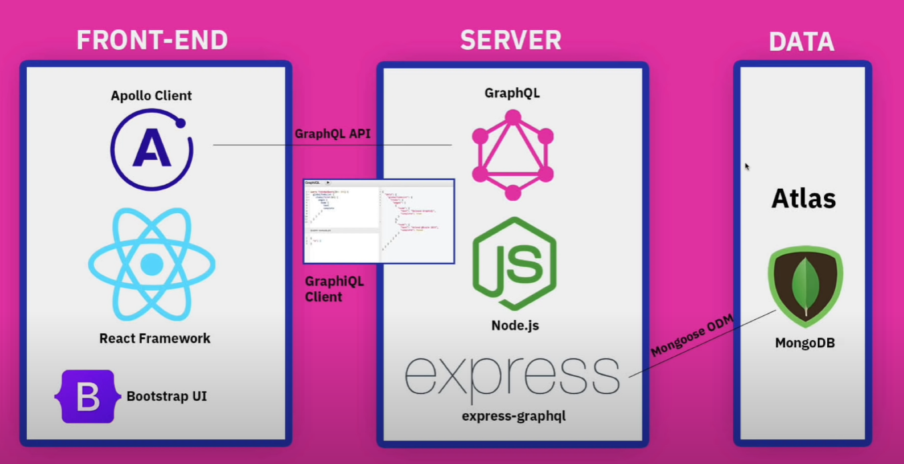
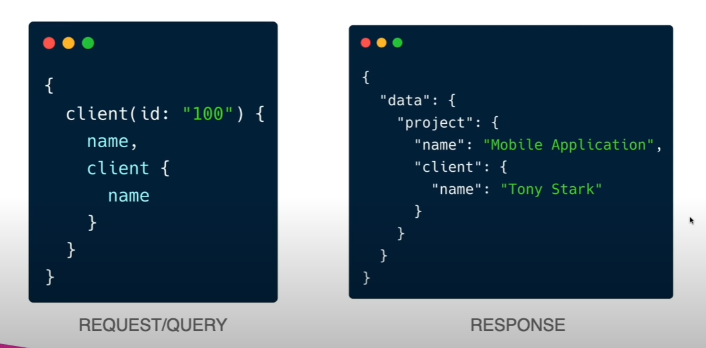
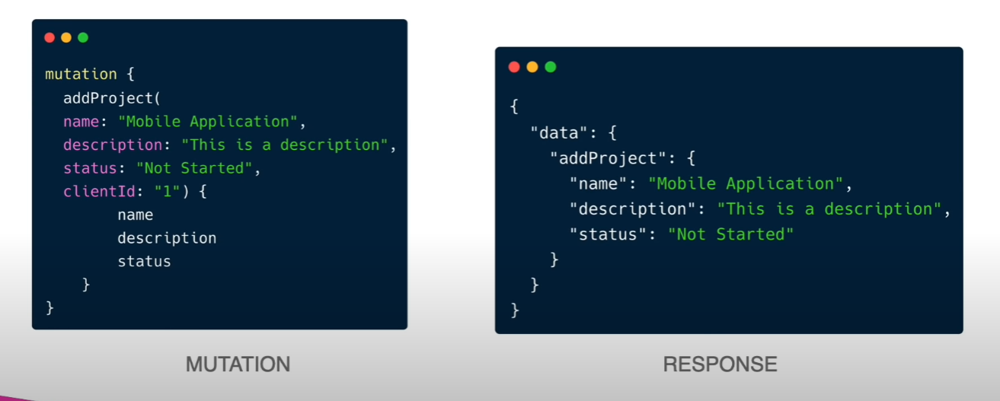

# MERN-Graphql
Full stack mern project

# Brad traversy's course 
https://www.youtube.com/watch?v=BcLNfwF04Kw&t=153s



# Graphql general
* graphql is a strongly typed language
* the servers have a schema that specifies all of the fileds as well as sub types
* we will using a package called "express-graphql" which is a graphql servier for node.js with tools to use with Express
* Apollo server is another way to do it 

# Graphql queries


# Graphql mutations



CRUD operations for clients and projects

Note on Delete

Once you perform a delete operation using a gql mutation you can update the UI state to reflect the deleted client in 2 ways

1) refetch the data using a new query

```
  const [deleteClient] = useMutation(DELETE_CLIENT, {
    variables: { id: props.client.id },
    refetchQueries: [{ query: GET_CLIENTS }],
  })
```

This is fine but if you have a lot of refetching then you might bog down the application so updating cache might be better in that sense.


2) update cache of apollo client

```
    update(cache, { data: { deleteClient } }) {
      const { clients } = cache.readQuery({ query: GET_CLIENTS });
      cache.writeQuery({
        query: GET_CLIENTS,
        data: { clients: clients.filter((client) => client.id !== deleteClient.id) },
      });
    }
```

# GraphiQL Tool

`